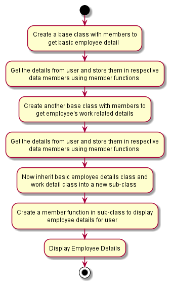

# Employee-Details_cpp
- Objective:

    To display Employee Details using class and objects.

The repository consists of following directories:

- Assets:

    Assets are flowchart files. We created our flowchart for the task using Plantuml and stored it here.

- Src:

    It contains our task's source. We can pull this source and work with it on any required time.

Following is the Flowchart for the task:

- Version:

    employee-details Version_v1.1.0